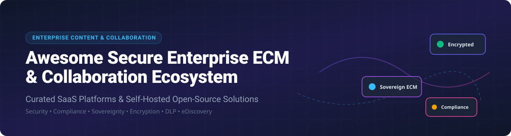

# Awesome Secure Enterprise Content Management & Collaboration Ecosystem 🔐🚀

  
  
  
  

---

## 💡 Overview & Market Landscape

This repository provides a comprehensive, curated directory of **Enterprise Content Management (ECM)** systems, **Secure File Sharing & Sync (EFSS)** solutions, **Digital Asset Management (DAM)** tools, and **Sovereign Collaboration Suites**. Designed for enterprise IT leaders, security engineers, compliance officers, and system administrators looking to deploy secure document governance, Data Loss Prevention (DLP), and eDiscovery frameworks.

---

## 📌 Table of Contents

- [☁️ SaaS & Hosted Enterprise Platforms](#%EF%B8%8F-saas--hosted-enterprise-platforms)
- [🔓 Open-Source & Self-Hosted Repositories](#-open-source--self-hosted-repositories)
- [🤝 How to Contribute](#-how-to-contribute)
- [⚠️ Disclaimer & Security Hardening](#%EF%B8%8F-disclaimer--security-hardening)
- [📈 Star History](#-star-history)

---

## ☁️ SaaS & Hosted Enterprise Platforms

> 📊 **Market Size & Structure**: The global Enterprise Content Management (ECM) market is estimated at **$75.4 Billion in 2026** (projected to exceed $130 Billion by 2030 at a CAGR of ~14.2%). The sector is **moderately fragmented**, anchored by mega-cap tech giants (Microsoft, Alphabet) while maintaining significant market share across specialized content governance providers (Box, OpenText, Egnyte, Hyland).

### 🏢 Commercial Platforms Comparison

Below is the structured breakdown of leading commercial ECM and file collaboration platforms, sorted by **Company Size (Revenue / Valuation)** in descending order:

| Company / Platform | Market Valuation / Revenue Size | Starting Paid Tier Pricing | Free Tier / Trial Plan Limits | Key Enterprise Features & Best For |
| :--- | :--- | :--- | :--- | :--- |
| **[Google Workspace Drive](https://workspace.google.com/products/drive/)** | **~$2.4 Trillion Market Cap** (Alphabet) | **$6.00 / user / month** (Business Starter) | **15 GB free forever per account** | Cloud storage with real-time co-authoring & AI enterprise search. *Best for Google ecosystem users.* |
| **[Microsoft SharePoint / OneDrive](https://www.microsoft.com/microsoft-365/sharepoint/collaboration)** | **~$2.3 Trillion Market Cap** (Microsoft) | **$6.00 / user / month** (Microsoft 365 Business Basic) | **30-day free trial** (Includes 1 TB OneDrive per user for up to 25 users) | Enterprise document libraries, versioning, workflows & compliance. *Best for Microsoft-centric organizations.* |
| **[Citrix ShareFile](https://www.sharefile.com/)** | **~$16.5 Billion Valuation** (Cloud Software Group) | **$10.00 / user / month** (Standard Plan) | **30-day free trial** (Full client portal access for up to 25 users) | Encrypted file transfer, client portals & compliance workflows. *Best for legal, accounting, & financial services.* |
| **[Dropbox Business](https://www.dropbox.com/business)** | **~$7.8 Billion Market Cap** (Dropbox Inc.) | **$15.00 / user / month** (Standard Plan) | **30-day free trial** (5 TB total storage for 3+ users) | Smart sync, file recovery, team sharing, and digital signatures. *Best for reliable file synchronization.* |
| **[OpenText Content Cloud](https://www.opentext.com/)** | **~$7.5 Billion Market Cap** (OpenText Corp.) | **$16.00 / user / month** (Core Content SaaS) | **30-day free trial** (10 GB test environment) | Deep ECM, enterprise archiving, document capture, and governance. *Best for global enterprises & records management.* |
| **[Box Enterprise](https://www.box.com/)** | **~$3.8 Billion Market Cap** (Box Inc.) | **$15.00 / user / month** (Business Plan) | **10 GB free forever** (100 MB single file upload limit) | Advanced content governance, DLP, classification, and workflow automation. *Best for strict content security.* |
| **[Hyland OnBase](https://www.hyland.com/)** | **~$3.5 Billion Enterprise Valuation** (Thoma Bravo) | **$18.00 / user / month** (Hosted SaaS Tier) | **14-day guided proof-of-concept trial** | Content services platform, case management, and regulatory automation. *Best for healthcare & government compliance.* |
| **[Egnyte](https://www.egnyte.com/)** | **~$1.2 Billion Valuation** (Private / Venture Backed) | **$20.00 / user / month** (Business Plan) | **15-day free trial** (1 TB trial storage for up to 10 users) | Hybrid cloud architecture, content governance, and ransomware protection. *Best for AEC & hybrid cloud setups.* |
| **[Axway Syncplicity](https://www.syncplicity.com/)** | **~$450 Million Market Cap** (Axway Software) | **$6.00 / user / month** (Business Plan) | **10 GB free forever** (Single user account) | Enterprise file sync and sharing (EFSS) with policy enforcement. *Best for mobile enterprise file security.* |

---

## 🔓 Open-Source & Self-Hosted Repositories

Below are top open-source Enterprise Content Management, Document Indexing, and Sovereign Collaboration projects on GitHub, **sorted in descending order by GitHub Star Count** 🌟.

- **[AppFlowy](https://github.com/AppFlowy-IO/AppFlowy)**   
  Open-source secure workspace and Notion alternative giving users control over data privacy and offline storage.

- **[AFFiNE](https://github.com/toeverything/AFFiNE)**   
  Hyper-canvas knowledge base and privacy-first document collaboration workspace built for self-hosted enterprise teams.

- **[Paperless-ngx](https://github.com/paperless-ngx/paperless-ngx)**   
  Community-favorite document indexer and archivist that transforms physical documents into searchable digital archives with OCR.

- **[Logseq](https://github.com/logseq/logseq)**   
  Privacy-first, open-source knowledge management and organizational document platform operating over local markdown files.

- **[Nextcloud Hub / Server](https://github.com/nextcloud/server)**   
  The de facto open-source sovereign enterprise collaboration suite (File Sync, Nextcloud Office, Talk, Groupware, Deck).

- **[Teable](https://github.com/teableio/teable)**   
  Super-fast, real-time enterprise content database and collaborative table powered by PostgreSQL.

- **[BookStack](https://github.com/BookStackApp/BookStack)**   
  Simple, self-hosted platform for storing and organizing enterprise documentation, wikis, and structured manuals.

- **[Seafile](https://github.com/haiwen/seafile)**   
  High-performance open-source file sync and sharing with built-in client drive mapping and library encryption.

- **[DocumenSO](https://github.com/documenso/documenso)**   
  Open-source document signing infrastructure and enterprise e-signature software alternative.

- **[Filestash](https://github.com/mickael-kerjean/filestash)**   
  Modern web application manager for SFTP, S3, FTP, WebDAV, Git, and cloud storage backends.

- **[ownCloud Core](https://github.com/owncloud/core)**   
  Self-hosted file sync and share platform for team file governance and enterprise cloud storage access.

- **[CryptPad](https://github.com/cryptpad/cryptpad)**   
  Zero-knowledge, end-to-end encrypted real-time collaboration suite (Rich text, Sheets, Code, Kanban, Whiteboard).

- **[ONLYOFFICE Docs](https://github.com/ONLYOFFICE/DocumentServer)**   
  Collaborative online office suite providing native compatibility with Microsoft Office document formats.

- **[OpenCloud](https://github.com/opencloud-eu/opencloud)**   
  Modern Go-based cloud file management platform built for GDPR-compliant sovereign enterprise storage.

- **[Joomla! CMS](https://github.com/joomla/joomla-cms)**   
  Flexible open-source content management system for corporate publishing and document access control.

- **[Drupal](https://github.com/drupal/drupal)**   
  Enterprise open-source CMS platform with modular access control, workflow capabilities, and digital asset management.

- **[Collabora Online](https://github.com/CollaboraOnline/online)**   
  Enterprise-grade online office suite based on LibreOffice with real-time co-authoring integration for ECMs.

- **[Liferay Portal](https://github.com/liferay/liferay-portal)**   
  Enterprise digital experience platform (DXP) with integrated content management and portal governance.

- **[Pydio Cells](https://github.com/pydio/cells)**   
  Golang-based enterprise document management and file sharing platform built on a microservices architecture.

- **[XWiki Platform](https://github.com/xwiki/xwiki-platform)**   
  Advanced open-source enterprise wiki and document governance platform with extensible metadata modules.

- **[OpenKM DMS](https://github.com/openkm/document-management-system)**   
  Document management system featuring workflow engine, document capture, OCR, and automated metadata ingestion.

- **[Mayan EDMS](https://gitlab.com/mayan-edms/mayan-edms)**   
  Python-based electronic document management system (EDMS) with OCR, indexing, and compliance workflows.

- **[Nuxeo ECM](https://github.com/nuxeo/nuxeo)**   
  Architectural content services platform for enterprise digital asset management and document automation.

- **[Apache OpenMeetings](https://github.com/apache/openmeetings)**   
  Open-source web conferencing and collaborative whiteboard platform for secure enterprise communications.

- **[CrafterCMS](https://github.com/craftercms/craftercms)**   
  Git-based headless enterprise content management platform for dynamic web and mobile applications.

- **[Plone CMS](https://github.com/plone/Products.CMFPlone)**   
  Battle-tested Python enterprise content management system renowned for high security and granular permissions.

- **[Alfresco Community](https://github.com/Alfresco/alfresco-community-repo)**   
  Enterprise content management repository offering core ECM capabilities, records management, and CMIS support.

- **[Twake Workplace](https://github.com/linagora/twake-workplace)**   
  Sovereign enterprise collaborative workplace featuring Matrix messaging, JMAP email, drive, and OnlyOffice.

- **[LogicalDOC Community](https://github.com/logicaldoc/community)**   
  High-performance document management system focused on full-text indexing, search, and document tracking.

---

## 🤝 How to Contribute

Contributions are welcome! Help us maintain the most comprehensive and up-to-date repository for enterprise content management and secure collaboration:

1. 🍴 **Fork the repository** on GitHub.
2. ➕ **Add or update entries** in `README.md` maintaining table/list schema.
3. 📝 **Ensure accurate metrics**: Include vendor name, product link, 1–2 sentence description, exact pricing tier, and open-source star badge.
4. 🚀 **Submit a Pull Request** with a clear title and brief description of additions.

---

## ⚠️ Disclaimer & Security Hardening

- 🔐 **Data Security & Privacy**: Self-hosted ECM software requires thorough environment hardening, TLS/SSL transport encryption, disk encryption (LUKS/dm-crypt), and strict RBAC policies.
- 📜 **Regulatory Compliance**: Evaluate solutions against GDPR, HIPAA, SOC 2 Type II, ISO 27001, and SecNumCloud requirements according to your operational jurisdiction.
- 🔑 **Encryption Trade-offs**: E2E zero-knowledge tools (e.g. CryptPad) protect data content from server operators but restrict server-side full-text search and admin recovery.

---

## 📈 Star History

---

  <b>Made with ❤️ for IT leaders, security engineers, compliance officers, and open-source software enthusiasts worldwide.</b>

